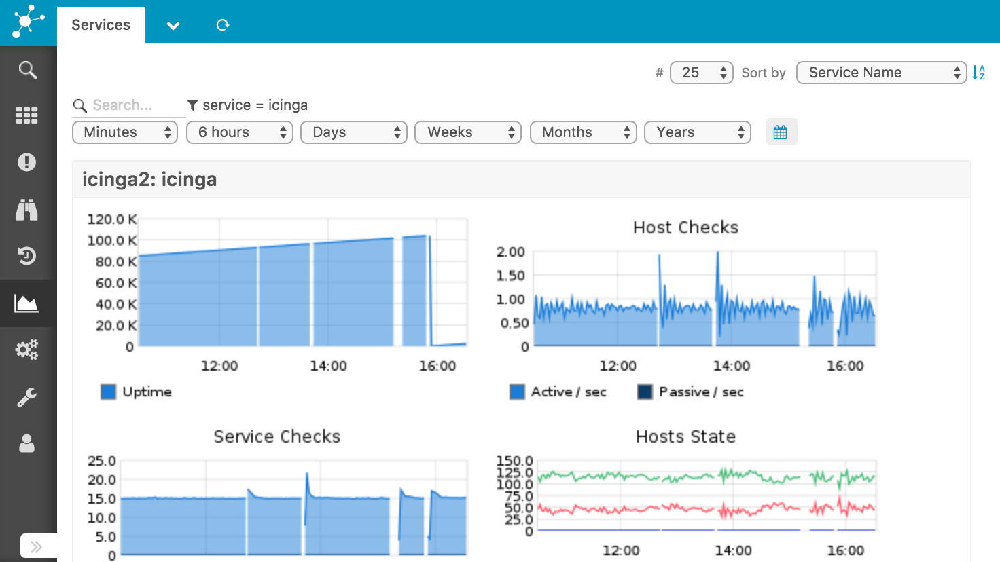
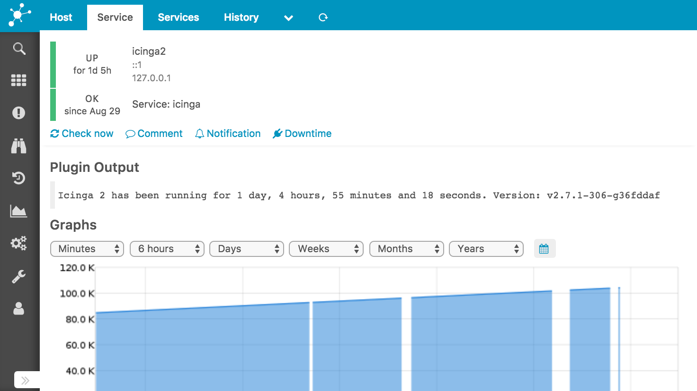

# Graphite - Icinga Web 2 Module

This module integrates an existing [Graphite](https://graphite.readthedocs.io/en/latest/)
installation in your [Icinga Web 2](https://www.icinga.com/products/icinga-web-2/)
frontend.

It provides a new menu section with two general overviews for hosts and
services as well as an extension to the host and service detail view of
the monitoring module.

## Documentation

* [Installation](doc/02-Installation.md)
* [Configuration](doc/03-Configuration.md)
* [Templates](doc/04-Templates.md)
* [Demonstration](doc/06-Demonstration.md)
